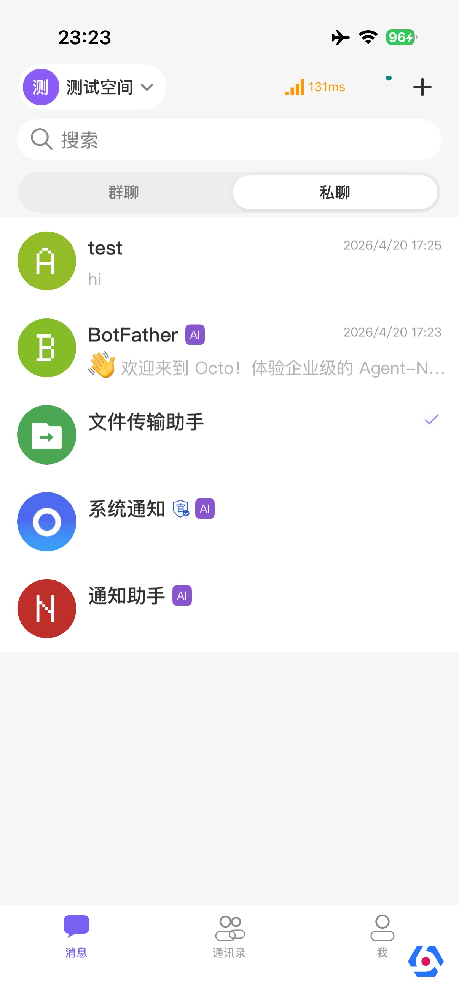
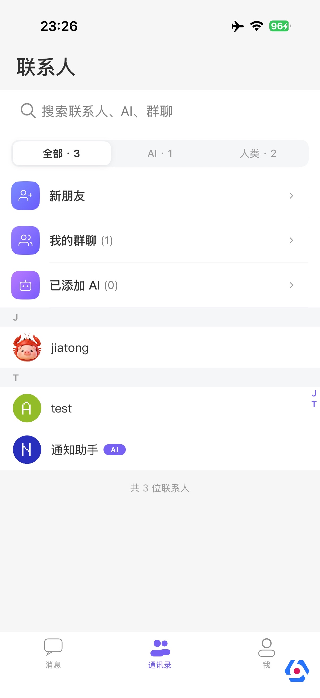
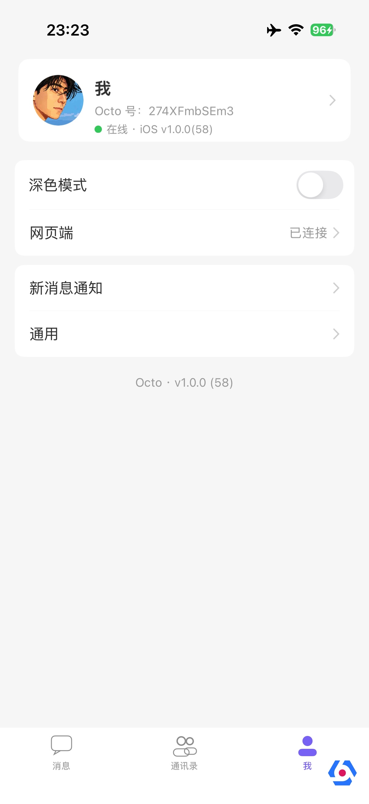

# Octo iOS

> 企业级即时通讯客户端（iOS）。Demo Space自主设计开发，开源版本。

Octo 是Demo Space自主研发的企业级即时通讯客户端，面向企业内部协作与多空间沟通场景。我们将其在内部多年生产环境中打磨过的核心能力整理开源，希望成为团队构建自有 IM 应用时一份可信赖的参考实现与可直接复用的工程基线。

**关键能力**

- 一对一 / 群聊 / 频道（多空间架构）
- 消息漫游、阅读回执、撤回、转发、合并转发、全文搜索
- 富文本、图片、文件、语音、短视频、表情、位置、卡片消息
- AI 助手集成（一键群聊总结、AI Bot 对话、自定义提示词）
- 端到端通知（APNs + 本地通知 + 离线推送、子区精准提醒）
- 多空间（Space）切换、子区（Topic）讨论
- 联系人、组织架构、实名认证徽章
- 深浅色主题、动态字体、无障碍

⚠️ 当前仓库正在做开源准备（许可证清理、敏感配置外置、命名归一）。在所有 [P0–P5](#路线图) 阶段完成前，本仓库尚未进入稳定可发布状态。

---

## 截图

| 会话列表 | 通讯录 | 个人中心 |
|---|---|---|
|  |  |  |

---

## 项目结构

> WuKong* 命名沿用上游开源项目，遵循 MIT 协议保留；主 App target 计划在 P6 阶段重命名为 Octo。

```
.
├── TangSengDaoDao/          # 主 App target（P6 重命名为 Octo）
├── ShareExtension/          # 系统分享扩展
├── NotificationService/     # 推送通知服务扩展
├── NotificationContent/     # 通知内容扩展
├── Modules/                 # 业务模块
│   ├── WuKongIMiOSSDK/      # IM 协议层 SDK（连接管理、消息收发、本地存储）
│   ├── WuKongBase/          # 基础组件（聊天 UI、会话列表、通用组件）
│   ├── WuKongLogin/         # 登录、第三方登录、注册
│   ├── WuKongContacts/      # 联系人、群组、空间
│   └── WuKongDataSource/    # 数据源抽象
├── Vendor/                  # 第三方组件
├── docs/                    # 项目文档与截图
├── LICENSE                  # Apache License 2.0
├── NOTICE                   # 第三方组件归属声明
└── TangSengDaoDaoiOS.xcworkspace
```

---

## 构建与运行

### 环境要求

| 项 | 版本 |
|---|---|
| macOS | 14.0+ |
| Xcode | 15.0+ |
| iOS Deployment Target | 13.0+ |
| CocoaPods | 1.14+ |
| Ruby | 3.0+（CocoaPods 依赖） |

### 步骤

```bash
# 1. 克隆仓库
git clone <repo-url> octo-ios && cd octo-ios

# 2. 安装依赖
pod install

# 3. 复制配置文件模板并填入你自己的 Key
cp OctoConfig.xcconfig.template OctoConfig.xcconfig
# 然后用编辑器填入 IM 服务地址、崩溃统计 AppId、Apple Team ID 等

# 4. 打开工作区
open TangSengDaoDaoiOS.xcworkspace

# 5. 选择真机或模拟器，⌘R 运行
```

> 配置文件机制由开源准备的 P1 阶段引入。在那之前，需要直接在 `WKServerConfig.m` 等位置改服务地址。

### 后端服务

iOS 客户端通过 Octo 自有 IM 协议与服务端通讯。请部署配套的后端：

**👉 [Mininglamp-OSS/octo-server](https://github.com/Mininglamp-OSS/octo-server)**

部署完成后，把网关地址填入 `OctoConfig.xcconfig`。

---

## 架构概述

```
┌──────────────────────────────────────────────────────┐
│                  TangSengDaoDao (App)                │
│              AppDelegate / 推送 / 装配                │
└───────────────────┬──────────────────────────────────┘
                    │
        ┌───────────┴───────────┐
        ▼                       ▼
   ┌──────────┐          ┌─────────────┐
   │ WuKongBase │  ◀──▶  │ WuKongLogin │
   │ 聊天 UI    │          │  登录/注册   │
   │ 会话列表   │          └─────────────┘
   │ 通用组件   │
   └─────┬────┘          ┌────────────────┐
         │           ◀──▶│ WuKongContacts │
         │               │ 通讯录/群/空间 │
         │               └────────────────┘
         ▼
   ┌──────────────────┐
   │ WuKongIMiOSSDK   │  ←  连接 octo-server 网关
   │ 消息收发 / 同步  │
   │ 本地数据库       │
   └──────────────────┘
```

- **协议层**：`WuKongIMiOSSDK` 封装连接管理、心跳、消息序列化、本地数据库
- **业务层**：`WuKongBase` 收口所有 UI 与跨模块协作；`WuKongLogin` / `WuKongContacts` / `WuKongDataSource` 是横切关注点
- **应用层**：`TangSengDaoDao` target 只做 AppDelegate、推送注册和模块装配

> WuKong* 模块名沿用上游开源项目（MIT 协议），不做品牌化重命名。
> 仅主 App target 在 P6 阶段重命名为 Octo。

---

## 路线图

开源前的清理工作分阶段进行：

- [x] P0 低风险清理（LICENSE、.gitignore、敏感日志、NOTICE 框架）
- [ ] P1 配置文件外置（崩溃统计 AppId、IM 网关、Team ID 等收口到 `OctoConfig.xcconfig`）
- [ ] P2 内部信息脱敏（域名、邮箱、内部工单引用）
- [ ] P3 全源码 Apache 2.0 头部统一
- [ ] P4 子模块 podspec 规范化
- [ ] P5 不兼容许可证代码替换
- [ ] P6 主工程命名迁移（`TangSengDaoDao` → `Octo`，**仅主 App target**）
- [ ] P7 仓库历史清理（git filter-repo 去除已被替换的内部引用）

> **关于 WuKong* 模块的命名**：上游 WuKongIM iOS SDK 与 WuKongBase/Login/
> Contacts/DataSource 等模块名沿用上游开源项目（MIT 协议），不做品牌化重命名。
> 这样保留 MIT 归属、避免许可证误标，对开源用户也更透明。

发布后 Roadmap：端到端加密 / 桌面端 / 企业级管理后台 等。

---

## 贡献

欢迎提 Issue / PR。在动手前请阅读 [CONTRIBUTING.md](./CONTRIBUTING.md)。

---

## License

Octo iOS 在 [Apache License 2.0](./LICENSE) 下开源。第三方组件归属请见 [NOTICE](./NOTICE)。

```
Copyright 2026 MININGLAMP Technology and the OCTO contributors

Licensed under the Apache License, Version 2.0 (the "License");
you may not use this file except in compliance with the License.
```
