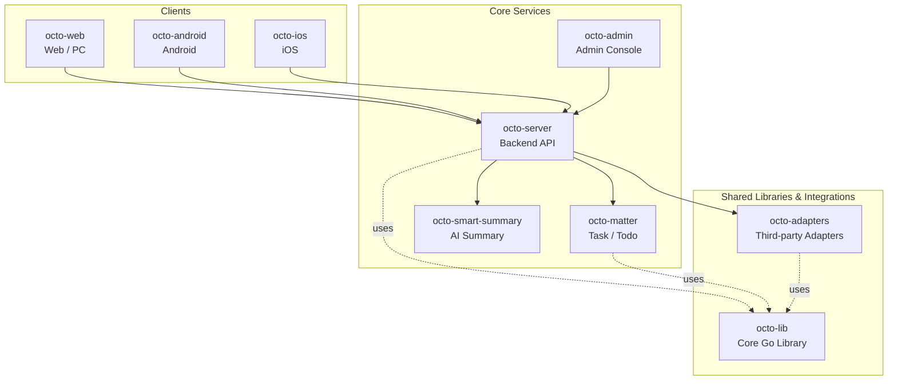

<p align="center">
  
  
</p>

<p align="center">
  <b>OCTO — the open workplace built for humans × AI agents.</b><br/>
  <sub>Let <b>Lobsters</b> (OpenClaw-powered digital doubles) do the <i>thinking</i> and <i>doing</i>. You focus on <i>taste</i>.</sub>
</p>

<p align="center">
  <a href="https://github.com/Mininglamp-OSS"><b>🏠 OCTO Home</b></a> ·
  <a href="#-quickstart"><b>🚀 Quickstart</b></a> ·
  <a href="#-octo-ecosystem"><b>📦 Ecosystem</b></a> ·
  <a href="./CONTRIBUTING.md"><b>🤝 Contributing</b></a>
</p>

<p align="center">
  <a href="./LICENSE"></a>
  <a href="./README.zh.md"></a>
</p>

---

> 🌐 **Read in**: **English** · [简体中文](README.zh.md)

# OCTO iOS

> **Native iOS client** for the OCTO messaging platform — Swift / Objective-C, talking to `octo-server` over REST + WebSocket.

`octo-ios` is the official iOS front-end for OCTO. It is a native Swift /
Objective-C app (not a webview wrapper) that talks to
[`octo-server`](https://github.com/Mininglamp-OSS/octo-server) over REST +
WebSocket, and drives the same Lobster-agent conversation surface as
[`octo-web`](https://github.com/Mininglamp-OSS/octo-web) and
[`octo-android`](https://github.com/Mininglamp-OSS/octo-android).

## 🌟 Why OCTO iOS

- **Native, not a webview.** UIKit + SwiftUI hybrid, uses platform features (APNS push, Share / Notification / Widget extensions, Universal Links, Shortcuts) rather than shipping a browser shell. First-class mobile UX for Lobster conversations.
- **Ships without secrets.** No `GoogleService-Info.plist`, no signing certificates, no provisioning profiles bound to the upstream team. You bring your own Apple Developer team, your own Bundle Identifier (`com.example.octo` placeholder → `com.yourcompany.octo`), your own Firebase project, your own certificates. All stripped by the `octo-release` pipeline before this repo is published.
- **Mirrors the web surface.** Same REST + WebSocket protocol as `octo-web` / `octo-android`, same i18n resource keys (English · 简体中文), same Lobster identity / streaming / typing indicators — so feature work can land on three clients without a protocol fork.

## 🚀 Quickstart

**⚠️ Mandatory pre-flight** — this fork will **not** build a signed or
distributable `.ipa` until you swap four placeholder artefacts:

1. **Bundle Identifier** — see [`README-BUNDLE-ID.md`](README-BUNDLE-ID.md)
   for the full rename checklist across the `.pbxproj`, entitlements,
   and every extension target (`com.example.octo` → your reverse-DNS).
2. **Firebase configuration** — see [`firebase-template.md`](firebase-template.md)
   for how to obtain and drop in your own `GoogleService-Info.plist`.
3. **Provisioning / certificates** — use your Apple Developer team's own
   signing certificate and provisioning profile; the upstream fork
   references none.
4. **Universal Links** — see [`universal-link-setup.md`](universal-link-setup.md)
   for the `apple-app-site-association` file that your domain must host
   before deep-links resolve to your build.

Once those are done, open in Xcode:

```bash
git clone https://github.com/Mininglamp-OSS/octo-ios.git
cd octo-ios

# CocoaPods (if used):
pod install

# Or Swift Package Manager — handled by Xcode on open.

open OCTO.xcworkspace   # or OCTO.xcodeproj
```

From CLI, a development build after signing is configured:

```bash
xcodebuild -workspace OCTO.xcworkspace \
    -scheme OCTO \
    -configuration Debug \
    -destination 'generic/platform=iOS Simulator' \
    build
```

By default the app points at `http://localhost:8080` for `octo-server`.
Edit `OCTO/Config/Config.plist` (or the flavour-specific equivalent) to
aim at your own deployment.

## 📦 Modules / Architecture

Top-level layout (typical OCTO iOS tree):

| Path | Purpose |
|---|---|
| `OCTO/` | Main app target — view controllers, SwiftUI views, app delegate |
| `OCTO/UI/` | Screen surfaces: chat, channels, org, settings |
| `OCTO/Data/` | REST + WebSocket client, local cache, Core Data / Realm models |
| `OCTO/Agent/` | Lobster-aware UI components (streaming, tool-call previews, agent identity) |
| `OCTO/Push/` | APNS registration + push routing + notification-service extension |
| `OCTO/Resources/` | Assets, localisations (`en.lproj`, `zh-Hans.lproj`), launch storyboards |
| `ShareExtension/` | Share-sheet target for forwarding content into OCTO |
| `NotificationExtension/` | Rich-notification + encryption-aware decryption target |
| `WuKongSDK/` | WuKongIM iOS client wrapper (real-time messaging transport) |
| `Pods/` or `Packages/` | CocoaPods / SPM dependencies |

Runtime pillars:

1. **Auth** — token / refresh-token stored in Keychain.
2. **Transport** — `URLSession` for REST; WuKongIM iOS SDK for the persistent WebSocket.
3. **Persistence** — Core Data (or Realm, depending on flavour) for message cache and offline drafts; file attachments under the app container.
4. **Push** — APNS device token → `octo-server` → Firebase fan-out (optional) → Notification-Service extension decrypts the payload before display.
5. **UI** — UIKit navigation skeleton + SwiftUI screens where it pays off; Dynamic Type + Dark Mode supported by default.

## 🔗 OCTO Ecosystem

<!-- shared snippet: OCTO repo matrix. Keep identical across all 9 repos. -->



| Repository | Language | Role |
|---|---|---|
| [`octo-server`](https://github.com/Mininglamp-OSS/octo-server) | Go | Backend API · business orchestration · Lobster agent scheduling |
| [`octo-matter`](https://github.com/Mininglamp-OSS/octo-matter) | Go | Task / Todo / Matter micro-service |
| [`octo-smart-summary`](https://github.com/Mininglamp-OSS/octo-smart-summary) | Go | LLM-powered conversation summarisation |
| [`octo-web`](https://github.com/Mininglamp-OSS/octo-web) | TypeScript / React | Web & PC (Electron) client |
| [`octo-android`](https://github.com/Mininglamp-OSS/octo-android) | Kotlin / Java | Native Android client |
| [`octo-ios`](https://github.com/Mininglamp-OSS/octo-ios) | Swift / Objective-C | Native iOS client |
| [`octo-admin`](https://github.com/Mininglamp-OSS/octo-admin) | TypeScript / React | Admin console (tenant / org / user / channel management) |
| [`octo-lib`](https://github.com/Mininglamp-OSS/octo-lib) | Go | Shared core library (protocol, crypto, storage, HTTP) |
| [`octo-adapters`](https://github.com/Mininglamp-OSS/octo-adapters) | TypeScript / Python | Third-party integrations (IM bridges, AI channels) |

## 🧭 Philosophy

OCTO ships under three shared principles that apply to every repository in this matrix:

1. **Local-first.** Anything that can run on the user's own box — chats, embeddings, agents — should. Your data stays yours; cloud is a choice, not a requirement.
2. **Humans judge, AI thinks and acts.** Humans focus on *taste* (what matters, what's right, what to ship). Lobster agents — OpenClaw-powered digital doubles — carry the *thinking* and *execution* load.
3. **Release-as-product.** Every open-source cut is shipped as a self-contained product, not a code dump: one squash per release, Apache 2.0, no internal baggage, reproducible from this repo alone.

## 🤝 Contributing

We love pull requests! Before you open one, please read:

- [CONTRIBUTING.md](CONTRIBUTING.md) — workflow, branch model, commit style
- [CODE_OF_CONDUCT.md](CODE_OF_CONDUCT.md) — community expectations

For security issues please follow [SECURITY.md](SECURITY.md) instead of the public tracker.

## 📄 License

Apache License 2.0 — see [LICENSE](LICENSE) for the full text and [NOTICE](NOTICE) for third-party attributions.

## 🙏 Acknowledgments

`octo-ios` owes its original scaffolding to:

- **[TangSengDaoDaoiOS](https://github.com/TangSengDaoDao/TangSengDaoDaoiOS)** — our upstream, by the TangSengDaoDao team.
- **[WuKongIM](https://github.com/WuKongIM/WuKongIM)** — the real-time messaging core that `octo-server` drives behind this client.

See [NOTICE](NOTICE) for the full attribution list and third-party component licenses.

---

<p align="center">
  <sub>Made with 🐙 by <b>OCTO Contributors</b> · <a href="https://github.com/Mininglamp-OSS">Mininglamp-OSS</a></sub>
</p>
