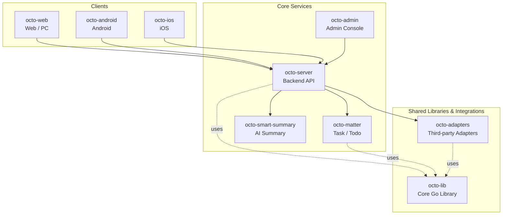

<p align="center">
  
  
</p>

<p align="center">
  <b>OCTO — the open workplace built for humans × AI agents.</b><br/>
  <sub>Let <b>Lobsters</b> (OpenClaw-powered digital doubles) do the <i>thinking</i> and <i>doing</i>. You focus on <i>taste</i>.</sub>
</p>

<p align="center">
  <a href="https://github.com/Mininglamp-OSS"><b>🏠 OCTO Home</b></a> ·
  <a href="#-quickstart"><b>🚀 Quickstart</b></a> ·
  <a href="#-octo-ecosystem"><b>📦 Ecosystem</b></a> ·
  <a href="./CONTRIBUTING.md"><b>🤝 Contributing</b></a>
</p>

<p align="center">
  <a href="./LICENSE"></a>
  <a href="https://developer.apple.com/ios/"></a>
  <a href="https://developer.apple.com/swift/"></a>
  <a href="./README.zh.md"></a>
</p>

---

> 🌐 **Read in**: **English** · [简体中文](README.zh.md)

# OCTO iOS

> **Native iOS client** for the OCTO messaging platform — Objective-C + Swift, talks to `octo-server` over the WuKongIM TCP protocol.

`octo-ios` is the iPhone & iPad client for OCTO. It ships the full chat
experience (1:1, group, channel, multi-space), AI agent surfaces (Lobster
dialogs, one-tap conversation summary), and a CocoaPods-based modular layout
that's easy to fork and re-skin for in-house IM deployments.

## 🌟 Why OCTO iOS

- **Production-grade client, not a demo.** Multi-space switching, real-name verification, burn-after-reading, share extension, push, AI agent integration — all wired up out of the box, not "TODO: implement".
- **Lobster-ready chat UI.** AI agent conversations are first-class: streaming replies, agent identity chips, one-tap conversation summary, custom-prompt agent dialogs.
- **Self-hostable, config-first.** All sensitive runtime values (Apple Team ID, Bugly App IDs, IM gateway hosts, URL scheme, Universal Link domain) live in a single `OctoConfig.xcconfig` (gitignored). No internal endpoints baked into source.

## 🚀 Quickstart

```bash
git clone https://github.com/Mininglamp-OSS/octo-ios.git
cd octo-ios

# 1. Copy & fill in private config
cp OctoConfig.xcconfig.template OctoConfig.xcconfig
# Edit OctoConfig.xcconfig — at minimum:
#   APPLE_TEAM_ID            (your 10-char Apple Team ID)
#   OCTO_APP_GROUP           (your provisioned App Group ID, e.g. group.com.yourorg.octo —
#                             must match Apple Developer config; cross-process share between
#                             main app and ShareExtension will silently fail otherwise)
#   OCTO_IM_PRESET_1_HOST    (host of your deployed octo-server)
#   OCTO_IM_PRESET_1_LABEL   (display name shown in the server picker)

# 2. Install dependencies
pod install

# 3. Open workspace and run
open OctoiOS.xcworkspace
# In Xcode: choose the OctoiOS scheme + a simulator/device, ⌘R
```

You'll need a reachable [`octo-server`](https://github.com/Mininglamp-OSS/octo-server)
instance. The login page accepts long-press on the **OCTO** title to switch
between up to three preset servers configured in `OctoConfig.xcconfig`.

## 📦 Modules / Architecture

```
.
├── Octo/                       # Main app target (AppDelegate, Tab assembly, push)
├── ShareExtension/             # System share-sheet extension
├── NotificationService/        # APNs service extension (rich notifications)
├── NotificationContent/        # Notification content extension
├── Modules/                    # CocoaPods local pods (business modules)
│   ├── WuKongIMiOSSDK/         # IM protocol SDK (connection, messaging, SQLite)
│   ├── WuKongBase/             # Chat UI, conversation list, shared utilities
│   ├── WuKongLogin/            # Login, register, third-party auth (Apple ID, OIDC)
│   ├── WuKongContacts/         # Contacts, groups, spaces
│   └── WuKongDataSource/       # Data-source abstraction layer
├── Vendor/                     # Vendored third-party (auto-update alert, …)
├── docs/                       # Design docs & screenshots
├── OctoConfig.xcconfig.template # Private config template (your file is gitignored)
├── Podfile
├── LICENSE                     # Apache 2.0
├── NOTICE                      # Third-party attributions
├── README.md
├── README.zh.md
├── CONTRIBUTING.md
├── SECURITY.md
└── CODE_OF_CONDUCT.md
```

| Path | Purpose |
|---|---|
| `Octo/` | Main app — AppDelegate, push registration, root tab controller |
| `Modules/WuKongIMiOSSDK/` | Long-lived TCP connection, heartbeat, message serialization, FMDB / SQLCipher storage |
| `Modules/WuKongBase/` | All chat UI — message cells, conversation list, input bar, WebView bridge, AI summary entry |
| `Modules/WuKongLogin/` | Sign-in flows (phone, Apple, OIDC) |
| `Modules/WuKongContacts/` | Contact list, group management, multi-space switching |
| `Modules/WuKongDataSource/` | Pluggable data-source protocols used across modules |

Build targets:

```bash
pod install                  # install / update dependencies
pod install --repo-update    # also refresh the CocoaPods spec repo
# Then open OctoiOS.xcworkspace and use Xcode for build / run / archive
```

For release builds see [RELEASE.md](RELEASE.md).
For Universal Links setup see [docs/universal-link-setup.md](docs/universal-link-setup.md).

## 🛠️ Configuration

All sensitive runtime values live in `OctoConfig.xcconfig` (gitignored). The
template lists every supported field — main ones:

| Field | Required | Purpose |
|---|---|---|
| `APPLE_TEAM_ID` | ✅ | Auto-signing (injected into pbxproj via `$(APPLE_TEAM_ID)`) |
| `OCTO_APP_GROUP` | ✅ | App Group ID for main app ↔ ShareExtension cross-process data (must match Apple Developer provisioning) |
| `OCTO_IM_PRESET_{1,2,3}_HOST` | one required | Up to 3 preset IM gateway hosts, shown in the server picker. Preset 1 is also used as default if `OCTO_IM_DEFAULT_HOST` is unset. |
| `OCTO_IM_PRESET_{1,2,3}_LABEL` |  | Display name for each preset |
| `OCTO_URL_SCHEME` |  | Custom URL scheme for deep-links / OIDC / share extension callback (default `octo`) |
| `OCTO_ASSOCIATED_DOMAIN` |  | Universal Link domain (substituted into `Octo.entitlements` at sign time) |
| `OCTO_INVITE_URL` |  | URL appended to invite-friend message (default `https://github.com/Mininglamp-OSS`) |
| `OCTO_BUGLY_APP_ID_MAIN` |  | Optional Tencent Bugly crash reporting (see below) |

### Optional integrations

**Bugly crash reporting** (closed-source SDK, disabled by default):

> ⚠️ Bugly is a Tencent commercial SDK governed by Tencent's own EULA, **not** Apache 2.0. The OSS distribution of Octo iOS ships **without** the Bugly framework — `pod install` only pulls it in when you provide your own `OCTO_BUGLY_APP_ID_MAIN`. Downstream redistributors who enable Bugly are responsible for accepting Tencent's terms.

1. Register at https://bugly.qq.com and download the iOS SDK
2. Place `Bugly.framework` at `Modules/WuKongBase/WuKongBase/Bugly.framework/`
3. Fill `OCTO_BUGLY_APP_ID_MAIN` in `OctoConfig.xcconfig`
4. Re-run `pod install` — auto-enables (`Bugly: ENABLED` printed)
5. **Stop Podfile.lock from leaking your Bugly setup into commits** (one-shot per clone):
   ```bash
   git update-index --skip-worktree Podfile.lock
   git update-index --skip-worktree Modules/WuKongBase/Example/Podfile.lock
   ```
   Filling a real `OCTO_BUGLY_APP_ID_MAIN` makes `WuKongBase.podspec` declare `s.dependency 'Bugly'`, so `pod install` rewrites `Podfile.lock` to include Bugly. The OSS-default lockfile in this repo is intentionally Bugly-free; `--skip-worktree` lets you `pod install` freely without polluting `git status`. To genuinely modify `Podfile`, undo it with `git update-index --no-skip-worktree Podfile.lock`, edit, and (before committing) regenerate the clean lockfile with `OCTO_BUGLY_APP_ID_MAIN` set to the `YOUR_BUGLY_APP_ID` sentinel.

## 🔗 OCTO Ecosystem

<!-- shared snippet: OCTO repo matrix. Keep identical across all 9 repos. -->



| Repository | Language | Role |
|---|---|---|
| [`octo-server`](https://github.com/Mininglamp-OSS/octo-server) | Go | Backend API · business orchestration · Lobster agent scheduling |
| [`octo-matter`](https://github.com/Mininglamp-OSS/octo-matter) | Go | Task / Todo / Matter micro-service |
| [`octo-smart-summary`](https://github.com/Mininglamp-OSS/octo-smart-summary) | Go | LLM-powered conversation summarisation |
| [`octo-web`](https://github.com/Mininglamp-OSS/octo-web) | TypeScript / React | Web & PC (Electron) client |
| [`octo-android`](https://github.com/Mininglamp-OSS/octo-android) | Kotlin / Java | Native Android client |
| [`octo-ios`](https://github.com/Mininglamp-OSS/octo-ios) | Swift / Objective-C | Native iOS client |
| [`octo-admin`](https://github.com/Mininglamp-OSS/octo-admin) | TypeScript / React | Admin console (tenant / org / user / channel management) |
| [`octo-lib`](https://github.com/Mininglamp-OSS/octo-lib) | Go | Shared core library (protocol, crypto, storage, HTTP) |
| [`octo-adapters`](https://github.com/Mininglamp-OSS/octo-adapters) | TypeScript / Python | Third-party integrations (IM bridges, AI channels) |

## 🧭 Philosophy

OCTO ships under three shared principles that apply to every repository in this matrix:

1. **Local-first.** Anything that can run on the user's own box — chats, embeddings, agents — should. Your data stays yours; cloud is a choice, not a requirement.
2. **Humans judge, AI thinks and acts.** Humans focus on *taste* (what matters, what's right, what to ship). Lobster agents — OpenClaw-powered digital doubles — carry the *thinking* and *execution* load.
3. **Release-as-product.** Every open-source cut is shipped as a self-contained product, not a code dump: one squash per release, Apache 2.0, no internal baggage, reproducible from this repo alone.

## 🤝 Contributing

We love pull requests! Before you open one, please read:

- [CONTRIBUTING.md](CONTRIBUTING.md) — workflow, branch model, commit style
- [CODE_OF_CONDUCT.md](CODE_OF_CONDUCT.md) — community expectations

For security issues please follow [SECURITY.md](SECURITY.md) instead of the public tracker.

## 📄 License

Released under **[Apache License 2.0](LICENSE)**. Our own source and the resulting binary contain **no statically-linked GPL or strong-copyleft code** — the historical `TelegramUtils/` (GPL v2) subtree and `SoundTouch` (LGPL v2.1) vendored code have been removed.

| Layer | License | Notes |
|---|---|---|
| Our new code (`Octo/`, extensions, new code in modules) | **Apache 2.0** | See [LICENSE](LICENSE) |
| `WuKong*` modules | **MIT** | Upstream [WuKongIM iOS SDK](https://github.com/WuKongIM/WuKongIMiOSSDK) — preserved with original attributions |
| `librlottie` (transitive, via `SDWebImageLottieCoder`) | **MIT** | Samsung rlottie has been MIT-licensed since 2020; see [NOTICE](NOTICE) |

Full third-party attribution lives in [NOTICE](NOTICE).

## 🙏 Acknowledgments

`octo-ios` builds on the shoulders of:

- **[WuKongIM iOS SDK](https://github.com/WuKongIM/WuKongIMiOSSDK)** — the real-time messaging protocol SDK that `octo-server` drives.
- **[TangSengDaoDao iOS](https://github.com/TangSengDaoDao/TangSengDaoDaoiOS)** — the upstream IM client this app's chat UI scaffolds from.

See [NOTICE](NOTICE) for the full attribution list and third-party component licenses.

---

<p align="center">
  <sub>Made with 🐙 by <b>OCTO Contributors</b> · <a href="https://github.com/Mininglamp-OSS">Mininglamp-OSS</a></sub>
</p>
