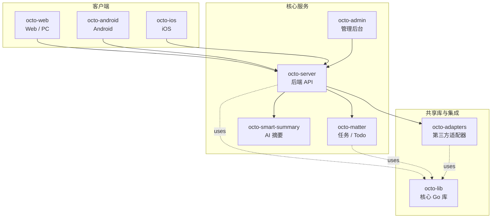

<p align="center">
  
  
</p>

<p align="center">
  <b>OCTO —— 为人和 AI Agent 协作而生的开源工作平台。</b><br/>
  <sub>让 <b>龙虾（Lobster / OpenClaw-powered digital double agents）</b>去「思」和「行」，让人专注于「品」。</sub>
</p>

<p align="center">
  <a href="https://github.com/Mininglamp-OSS"><b>🏠 OCTO 主页</b></a> ·
  <a href="#-快速开始"><b>🚀 快速开始</b></a> ·
  <a href="#-octo-生态"><b>📦 生态</b></a> ·
  <a href="./CONTRIBUTING.zh.md"><b>🤝 贡献</b></a>
</p>

<p align="center">
  <a href="./LICENSE"></a>
  <a href="./NOTICE"></a>
  <a href="https://developer.apple.com/ios/"></a>
  <a href="https://developer.apple.com/swift/"></a>
  <a href="./README.md"></a>
</p>

---

> 🌐 **语言**: [English](README.md) · **简体中文**

# OCTO iOS（简体中文）

> ⚠️ **许可证现状**：本仓库新代码采用 Apache 2.0，但**发布的二进制实际受 GPL v2 约束**——因为 `Modules/WuKongBase/.../TelegramUtils/` 仍然链接 GPL v2 代码（消息 cell 的手势状态机依赖）。如需 100% Apache 2.0 二进制（商业闭源发布），请先阅读下方 [许可](#-许可) 章节，先替换 Telegram 派生的手势/上下文菜单代码，再分发。剥离方案与依赖面见 [`TelegramUtils/README.md`](Modules/WuKongBase/WuKongBase/Classes/Sections/Common/TelegramUtils/README.md)。

> **原生 iOS 客户端** —— Objective-C + Swift，通过 WuKongIM TCP 协议与 `octo-server` 通信。

`octo-ios` 是 OCTO 的 iPhone & iPad 客户端。包含完整的聊天能力（一对一、
群、频道、多空间）、AI 助手交互（Lobster 对话、一键群聊总结），以及基于
CocoaPods 的模块化结构，方便企业自部署 IM 时 fork 与二次定制。

## 🌟 为什么选 OCTO iOS

- **生产级客户端，不是 demo。** 多空间切换、实名认证、阅后即焚、分享扩展、推送、AI 助手集成 —— 全部一站到位，不是 "TODO: 待实现"。
- **天生为龙虾而做的聊天 UI。** AI Agent 会话是一等公民：流式回复、Agent 身份徽标、一键群聊总结、自定义 Prompt 的 Agent 对话。
- **可自部署、配置先行。** 所有敏感运行时值（Apple Team ID / Bugly AppId / IM 网关地址 / URL Scheme / Universal Link 域名）统一收口到 `OctoConfig.xcconfig`（gitignored）。没有任何内部地址硬编码在源码里。

## 🚀 快速开始

```bash
git clone https://github.com/Mininglamp-OSS/octo-ios.git
cd octo-ios

# 1. 复制并填写私有配置
cp OctoConfig.xcconfig.template OctoConfig.xcconfig
# 编辑 OctoConfig.xcconfig，至少填入：
#   APPLE_TEAM_ID            （你的 10 位 Apple Team ID）
#   OCTO_APP_GROUP           （你在 Apple Developer 后台 provision 的 App Group，
#                              如 group.com.yourorg.octo；与 Apple 后台必须一致，
#                              否则主 App 与分享扩展之间的共享数据会静默失败）
#   OCTO_IM_PRESET_1_HOST    （你部署的 octo-server 地址）
#   OCTO_IM_PRESET_1_LABEL   （切换服务器面板上显示的名字）

# 2. 安装依赖
pod install

# 3. 打开工作区并运行
open OctoiOS.xcworkspace
# Xcode 中选 OctoiOS scheme + 模拟器/真机，⌘R
```

你需要先准备一个可访问的 [`octo-server`](https://github.com/Mininglamp-OSS/octo-server)
实例。登录页长按 **OCTO** 标题可呼出"切换服务器"弹窗，对应
`OctoConfig.xcconfig` 中配置的最多 3 个预设。

## 📦 模块与架构

```
.
├── Octo/                       # 主 App target（AppDelegate / Tab 装配 / 推送）
├── ShareExtension/             # 系统分享扩展
├── NotificationService/        # APNs 服务扩展（富推送）
├── NotificationContent/        # 通知内容扩展
├── Modules/                    # 业务模块（CocoaPods local pods）
│   ├── WuKongIMiOSSDK/         # IM 协议 SDK（连接管理、消息收发、本地 SQLite）
│   ├── WuKongBase/             # 聊天 UI、会话列表、通用工具
│   ├── WuKongLogin/            # 登录、注册、第三方鉴权（Apple ID / OIDC）
│   ├── WuKongContacts/         # 通讯录、群组、空间
│   └── WuKongDataSource/       # 数据源抽象层
├── Vendor/                     # vendored 第三方（升级弹窗等）
├── docs/                       # 设计文档与截图
├── OctoConfig.xcconfig.template # 私有配置模板（实际文件 gitignored）
├── Podfile
├── LICENSE                     # Apache 2.0
├── NOTICE                      # 第三方归属
├── README.md
├── README.zh.md
├── CONTRIBUTING.md
├── SECURITY.md
└── CODE_OF_CONDUCT.md
```

| 路径 | 作用 |
|---|---|
| `Octo/` | 主 App —— AppDelegate、推送注册、根 Tab 控制器 |
| `Modules/WuKongIMiOSSDK/` | 长连接、心跳、消息序列化、FMDB / SQLCipher 本地存储 |
| `Modules/WuKongBase/` | 所有聊天 UI —— 消息 cell、会话列表、输入栏、WebView 桥、AI 总结入口 |
| `Modules/WuKongLogin/` | 登录流程（手机号、Apple、OIDC） |
| `Modules/WuKongContacts/` | 通讯录、群管理、多空间切换 |
| `Modules/WuKongDataSource/` | 跨模块共用的数据源协议 |

构建命令：

```bash
pod install                  # 安装 / 更新依赖
pod install --repo-update    # 同时刷新 CocoaPods spec repo
# 之后用 Xcode 打开 OctoiOS.xcworkspace 进行 build / run / archive
```

正式发版流程见 [RELEASE.md](RELEASE.md)。
Universal Links 配置见 [docs/universal-link-setup.md](docs/universal-link-setup.md)。

## 🛠️ 配置

所有敏感运行时值都在 `OctoConfig.xcconfig` 中（gitignored）。模板列出所有支持
字段，主要的：

| 字段 | 是否必填 | 用途 |
|---|---|---|
| `APPLE_TEAM_ID` | ✅ | 自动签名（通过 `$(APPLE_TEAM_ID)` 注入 pbxproj） |
| `OCTO_APP_GROUP` | ✅ | 主 App ↔ ShareExtension 跨进程数据共享所用 App Group ID（必须与 Apple Developer 后台 provisioning 一致） |
| `OCTO_IM_PRESET_{1,2,3}_HOST` | 至少 1 个 | 最多 3 个 IM 网关预设，在"切换服务器"面板显示。`OCTO_IM_DEFAULT_HOST` 未设时也作默认。 |
| `OCTO_IM_PRESET_{1,2,3}_LABEL` |  | 各预设的显示名 |
| `OCTO_URL_SCHEME` |  | 深链 / OIDC 回跳 / 分享扩展回跳的自定义 URL scheme（默认 `octo`） |
| `OCTO_ASSOCIATED_DOMAIN` |  | Universal Link 域名（签名阶段注入 `Octo.entitlements`） |
| `OCTO_INVITE_URL` |  | 邀请好友文案末尾拼接的链接（默认 `https://github.com/Mininglamp-OSS`） |
| `OCTO_BUGLY_APP_ID_MAIN` |  | 腾讯 Bugly 崩溃统计（可选，详见下方） |

### 可选集成

**Bugly 崩溃统计**（闭源 SDK，默认禁用）：
1. 到 https://bugly.qq.com 注册并下载 iOS SDK
2. 把 `Bugly.framework` 放到 `Modules/WuKongBase/WuKongBase/Bugly.framework/`
3. 在 `OctoConfig.xcconfig` 填入 `OCTO_BUGLY_APP_ID_MAIN`
4. 重新 `pod install` —— 自动启用（输出 `Bugly: ENABLED`）

## 🔗 OCTO 生态

<!-- 共享片段：OCTO 仓库矩阵。9 个仓库之间保持一致。 -->



| 仓库 | 语言 | 职责 |
|---|---|---|
| [`octo-server`](https://github.com/Mininglamp-OSS/octo-server) | Go | 后端 API · 业务编排 · 龙虾 Agent 调度 |
| [`octo-matter`](https://github.com/Mininglamp-OSS/octo-matter) | Go | 任务 / Todo / Matter 微服务 |
| [`octo-smart-summary`](https://github.com/Mininglamp-OSS/octo-smart-summary) | Go | 基于 LLM 的会话摘要服务 |
| [`octo-web`](https://github.com/Mininglamp-OSS/octo-web) | TypeScript / React | Web 与 PC（Electron）客户端 |
| [`octo-android`](https://github.com/Mininglamp-OSS/octo-android) | Kotlin / Java | 原生 Android 客户端 |
| [`octo-ios`](https://github.com/Mininglamp-OSS/octo-ios) | Swift / Objective-C | 原生 iOS 客户端 |
| [`octo-admin`](https://github.com/Mininglamp-OSS/octo-admin) | TypeScript / React | 管理后台（租户 / 组织 / 用户 / 频道管理） |
| [`octo-lib`](https://github.com/Mininglamp-OSS/octo-lib) | Go | 共享核心库（协议 / 加密 / 存储 / HTTP） |
| [`octo-adapters`](https://github.com/Mininglamp-OSS/octo-adapters) | TypeScript / Python | 第三方集成（IM 桥接、AI 渠道） |

## 🧭 设计哲学

OCTO 遵循三条共用原则 —— 这套矩阵里的每个仓都一致：

1. **本地优先（Local-first）。** 能跑在用户本机的一切（对话、向量、智能体）都应尽量在本机完成。你的数据属于你；云是可选项，不是前置条件。
2. **人做「品」，AI 做「思」与「行」。** 人聚焦在品味（什么重要、什么对、该发什么）。龙虾（OpenClaw 驱动的数字分身）承担思考与执行。
3. **Release-as-product（每次发布即产品）。** 每一次开源切片都是一个自洽的产品，不是代码倾倒：一个 release 一次 squash，Apache 2.0，不夹带内部包袱，单仓即可复现。

## 🤝 贡献

欢迎提 Pull Request！开 PR 前请先读：

- [CONTRIBUTING.zh.md](CONTRIBUTING.zh.md) —— 工作流、分支模型、commit 规范
- [CODE_OF_CONDUCT.zh.md](CODE_OF_CONDUCT.zh.md) —— 社区行为准则

安全问题请按 [SECURITY.zh.md](SECURITY.zh.md) 上报，不要走公开 issue。

## 📄 许可

本仓库**混合多种许可证** —— 简单标"Apache 2.0"对**二进制**而言不准确：

| 层 | 许可证 | 说明 |
|---|---|---|
| 我们新写的代码（`Octo/`、扩展、各模块新代码） | **Apache 2.0** | 见 [LICENSE](LICENSE) |
| `WuKong*` 模块 | **MIT** | 上游 [WuKongIM iOS SDK](https://github.com/WuKongIM/WuKongIMiOSSDK) —— 保留原署名 |
| `WuKongBase/.../TelegramUtils/`（当前在编译链中的子集） | **GPL v2** | 派生自 [Telegram iOS](https://github.com/TelegramMessenger/Telegram-iOS)，被 `WKMessageCell` 等消息 cell 通过自定义手势状态机静态链接进二进制。剥离需要重写 `TapLongTapOrDoubleTapGestureRecognizer` + `ContextGesture` |

**二进制分发的实际影响：**

- 当前 Octo iOS 二进制由于静态链接 GPL v2 代码，**整体受 GPL v2 约束**。
- 如分发 Octo iOS 二进制，**必须**对被链接的 GPL 部分履行 GPL v2 义务（开放源码、不得附加额外限制等）。
- 如需 **100% Apache 2.0 二进制**（商业闭源发布），需要先替换 TelegramUtils 中仍在使用的符号。当前依赖面与替换计划见 [`TelegramUtils/README.md`](Modules/WuKongBase/WuKongBase/Classes/Sections/Common/TelegramUtils/README.md) 与 [`TelegramUtils/LICENSE`](Modules/WuKongBase/WuKongBase/Classes/Sections/Common/TelegramUtils/LICENSE)。

完整第三方致谢见 [NOTICE](NOTICE)。

## 🙏 致谢

`octo-ios` 站在以下项目的肩膀上：

- **[WuKongIM iOS SDK](https://github.com/WuKongIM/WuKongIMiOSSDK)** —— 实时消息协议 SDK，由 `octo-server` 驱动。
- **[TangSengDaoDao iOS](https://github.com/TangSengDaoDao/TangSengDaoDaoiOS)** —— 本项目聊天 UI 的上游脚手架。
- **[Telegram iOS](https://github.com/TelegramMessenger/Telegram-iOS)** —— 消息 cell 当前仍使用的部分显示层组件。

完整的致谢与第三方组件清单见 [NOTICE](NOTICE)。

---

<p align="center">
  <sub>由 <b>OCTO Contributors</b> 🐙 共同开发 · <a href="https://github.com/Mininglamp-OSS">Mininglamp-OSS</a></sub>
</p>
